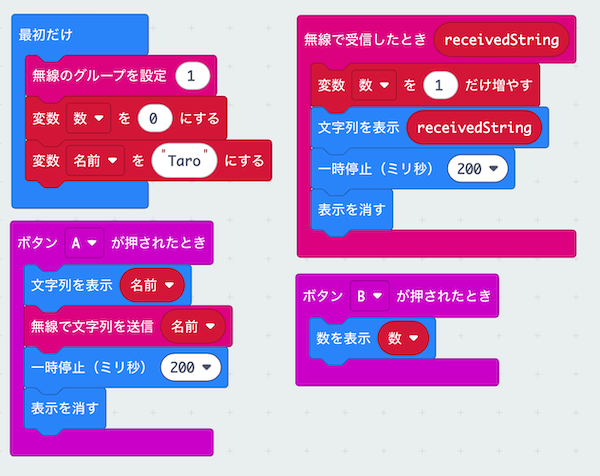
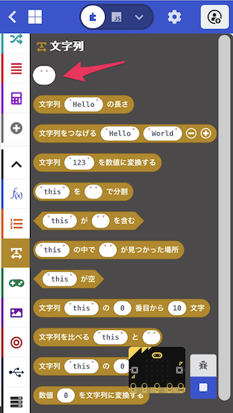
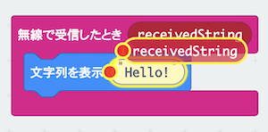

# ひみつの<ruby>通信機<rp>(</rp><rt>つうしんき</rt><rp>)</rp></ruby>を作ろう

## むずかしさ　★★★★☆

## 使うもの
1. マイクロビット本体（2台以上で<ruby>通信<rp>(</rp><rt>つうしん</rt><rp>)</rp></ruby>します）
2. <ruby>電池<rp>(</rp><rt>でんち</rt><rp>)</rp></ruby>ボックス

## プログラム

プロジェクト： https://makecode.microbit.org/_2UD2rWKFfPve

## 作り方

1. <ruby>変数<rp>(</rp><rt>へんすう</rt><rp>)</rp></ruby>`数`を作ります  
2. <ruby>変数<rp>(</rp><rt>へんすう</rt><rp>)</rp></ruby>`名前`を作ります  
3. <ruby>変数<rp>(</rp><rt>へんすう</rt><rp>)</rp></ruby>`名前`を入れるブロックの<ruby>文字列<rp>(</rp><rt>もじれつ</rt><rp>)</rp></ruby> `" "` は、<ruby>文字列<rp>(</rp><rt>もじれつ</rt><rp>)</rp></ruby>ブロックの一番上のブロックを使います

  

4. `文字列を表示`ブロックの<ruby>変数<rp>(</rp><rt>へんすう</rt><rp>)</rp></ruby> `receivedString`は、`無線で受信したとき`ブロックからコピー（<ruby>変数<rp>(</rp><rt>へんすう</rt><rp>)</rp></ruby>をタップして<ruby>移動<rp>(</rp><rt>いどう</rt><rp>)</rp></ruby>）します

  

5. プログラムをマイクロビットに書きこみます  

## 使い方

* Aボタンをおすと、名前が<ruby>画面<rp>(</rp><rt>がめん</rt><rp>)</rp></ruby>にでます  
* Bボタンをおすと、<ruby>通信<rp>(</rp><rt>つうしん</rt><rp>)</rp></ruby>した数が画面にでます  
* 名前は他の人のマイクロビットにも送られます  
* どこまではなれて<ruby>通信<rp>(</rp><rt>つうしん</rt><rp>)</rp></ruby>できるか<ruby>試<rp>(</rp><rt>ため</rt><rp>)</rp></ruby>してみよう  
