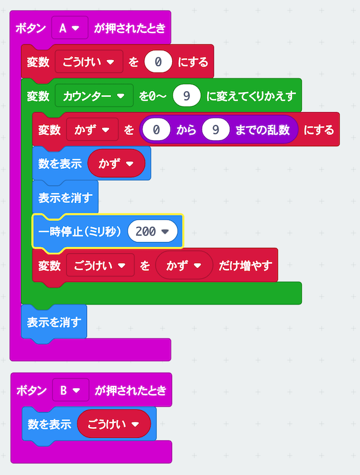

# フラッシュ<ruby>暗算<rp>(</rp><rt>あんざん</rt><rp>)</rp></ruby>で遊ぼう

## むずかしさ　★★☆☆☆

## 使うもの
1. マイクロビット本体

## プログラム

プロジェクト： https://makecode.microbit.org/_Dv5ezU6ab1Jp

## 作り方

1. <ruby>変数<rp>(</rp><rt>へんすう</rt><rp>)</rp></ruby>`かず`と`ごうけい`を作ります
2. プログラムをマイクロビットに書きこみます

## 使い方

* Aボタンをおすと、フラッシュ<ruby>暗算<rp>(</rp><rt>あんざん</rt><rp>)</rp></ruby>スタート！0〜9の<ruby>数字<rp>(</rp><rt>すうじ</rt><rp>)</rp></ruby>がでます
* <ruby>数字<rp>(</rp><rt>すうじ</rt><rp>)</rp></ruby>を<ruby>全部足<rp>(</rp><rt>ぜんぶた</rt><rp>)</rp></ruby>し<ruby>算<rp>(</rp><rt>ざん</rt><rp>)</rp></ruby>してみましょう
* Bボタンをおして答え合わせしてみよう

## チャレンジ

* 数が出ている<ruby>時間<rp>(</rp><rt>じかん</rt><rp>)</rp></ruby>を変えてむずかしくしてみよう
