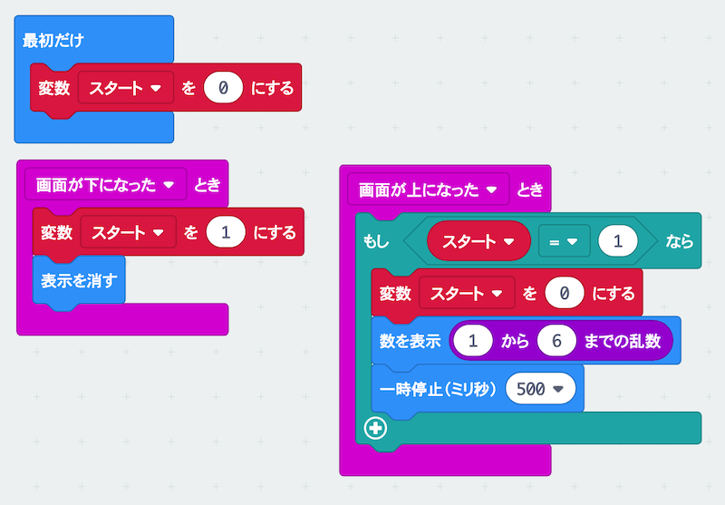
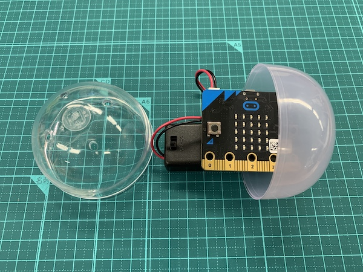
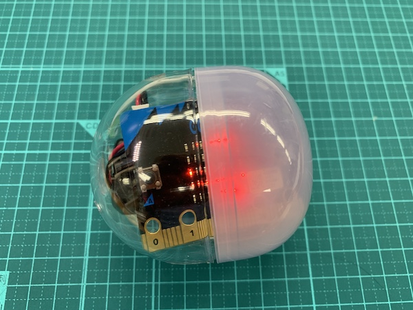

# サイコロを作ろう

## むずかしさ　★☆☆☆☆

## 使うもの
1. マイクロビット本体
2. <ruby>電池<rp>(</rp><rt>でんち</rt><rp>)</rp></ruby>ボックス
3. ガチャガチャのカプセル

## プログラム

プロジェクト： https://makecode.microbit.org/_eyYKLefCTY0w

## 作り方

1. <ruby>変数<rp>(</rp><rt>へんすう</rt><rp>)</rp></ruby>`スタート`を作ります
2. むらさき色の<ruby>`乱数`<rp>(</rp><rt>`らんすう`</rt><rp>)</rp></ruby>ブロックは<ruby>`計算`<rp>(</rp><rt>`けいさん`</rt><rp>)</rp></ruby>メニューにあります
3. プログラムをマイクロビットに書きこみます
4. <ruby>電池<rp>(</rp><rt>でんち</rt><rp>)</rp></ruby>ボックスとつなぎます
5. LEDが外から見えるようにカプセルに入れます（マイクロビットのケースは<ruby>外<rp>(</rp><rt>はず</rt><rp>)</rp></ruby>してください）  

## 使い方

* <ruby>転<rp>(</rp><rt>ころ</rt><rp>)</rp></ruby>がして<ruby>止<rp>(</rp><rt>と</rt><rp>)</rp></ruby>まると1〜6の数字がでるよ

