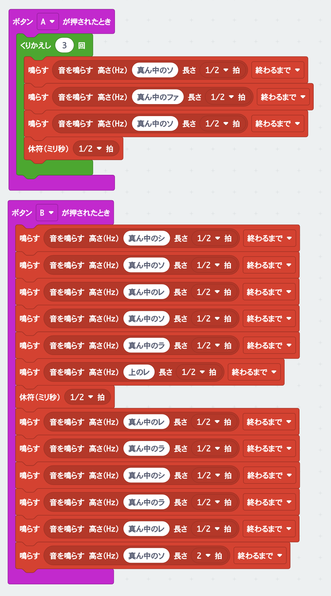

# もっとメロディーをならそう

## むずかしさ　★☆☆☆☆

## 使うもの
1. マイクロビット本体

## プログラム

プロジェクト： https://makecode.microbit.org/_XwEeR6LP7Wxb

## 作り方

1. プログラムをマイクロビットに書きこみます

## 使い方

* `Aボタン`をおすと、どこかのお店で聞いたことのあるメロディーがながれます
* `Bボタン`をおすと、どこかのお店で聞いたことのあるメロディーがながれます

