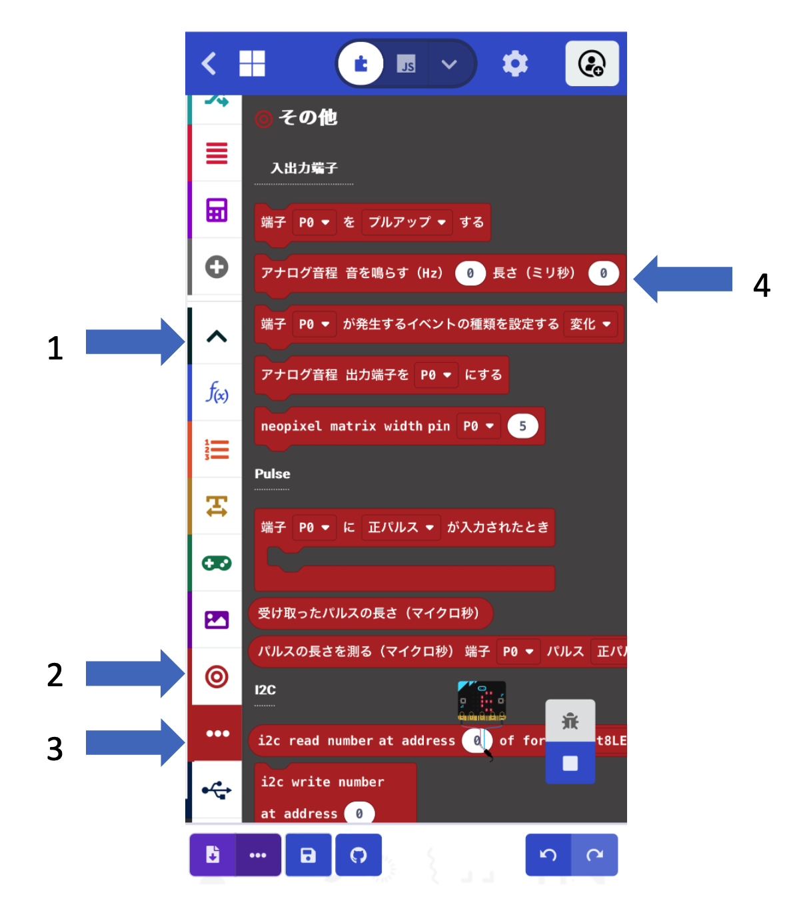

# ピコピコマシーンを作ろう

## むずかしさ　★☆☆☆☆

## 使うもの
1. マイクロビット本体

## プログラム

プロジェクト： https://makecode.microbit.org/_6zrFmKait5b8

## 作り方

1.  <ruby>変数<rp>(</rp><rt>へんすう</rt><rp>)</rp></ruby>`音程A`と`音程B`を作ります
2. `アナログ音程 音を鳴らす(Hz)`のブロックは、 <ruby>高度<rp>(</rp><rt>こうど</rt><rp>)</rp></ruby>なブロック→ <ruby>入出力端子<rp>(</rp><rt>にゅうしゅつりょくたんし</rt><rp>)</rp></ruby>→その他メニューにあります
3. プログラムをマイクロビットに書きこみます

## 使い方

*  <ruby>前後<rp>(</rp><rt>ぜんご</rt><rp>)</rp></ruby>にかたむけながら`Aボタン`をおすと、音の高さが変わります
* `Bボタン`をおすと、ピコピコ音がなります

